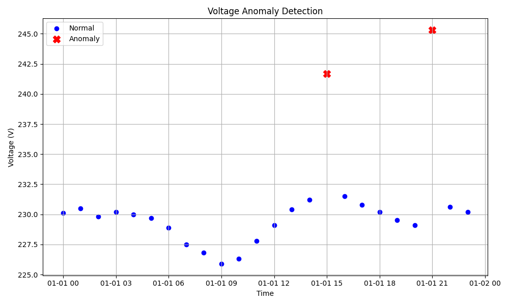
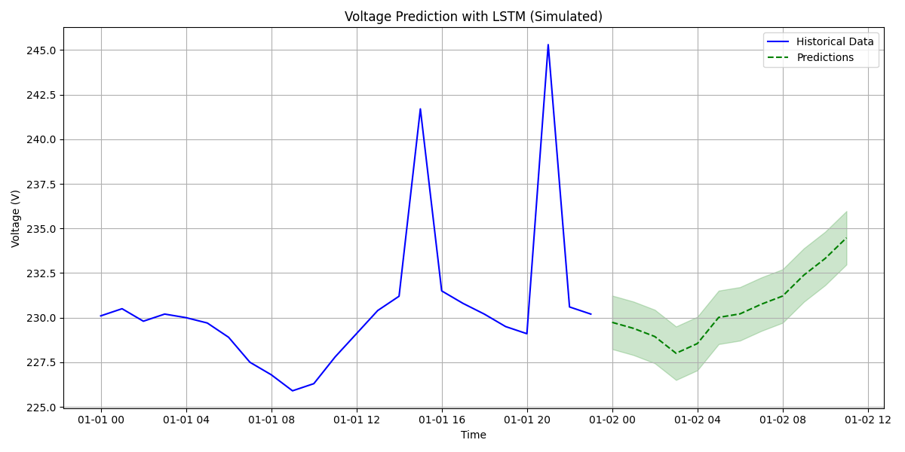

# Smart Grid ML Pipeline Demonstration

This document explains the machine learning components of the Smart Grid Optimization System.

## Overview

The Smart Grid Optimization System includes two primary ML components:

1. **Anomaly Detection**: Identifies unusual voltage readings that could indicate grid problems
2. **Voltage Prediction**: Forecasts future voltage values to aid in grid management

## How to Run the Demonstration

1. Make sure you have the required packages installed:
   ```
   pip install numpy pandas matplotlib scikit-learn
   ```

2. Run the demonstration script:
   ```
   python ml_demo.py
   ```

3. View the generated visualization files in the `sample_data` directory

## Anomaly Detection

Our system uses **DBSCAN** (Density-Based Spatial Clustering of Applications with Noise) for anomaly detection:

- **Why DBSCAN?** It can identify outliers without requiring labeled training data
- **How it works:** Points that don't belong to dense clusters are flagged as anomalies
- **In production:** This runs continuously to monitor the grid for unusual voltage patterns



## Voltage Prediction

We use **LSTM** (Long Short-Term Memory) neural networks for voltage prediction:

- **Why LSTM?** These networks excel at time-series forecasting by retaining information over time
- **Model architecture:** 2-layer LSTM (50→30 units) with dropout for regularization
- **In production:** Predictions are used for load scheduling and preventive maintenance



## Integration with Dashboard

In the full system, these ML components:

1. Process real-time data from the grid
2. Feed results to the dashboard for visualization
3. Trigger alerts when anomalies are detected
4. Provide predictions for informed decision-making

The frontend dashboard visualizes both the anomaly detection and prediction results in a user-friendly interface.

## Technical Implementation

For those interested in the technical details:

- **Feature engineering:** Voltage time series are processed into appropriate window sizes
- **Hyperparameters:** DBSCAN uses eps=3.0, min_samples=2 for our voltage data
- **Evaluation:** Models are evaluated using MAE (Mean Absolute Error) for predictions and F1-score for anomaly detection
- **Deployment:** Models run on the backend server and communicate with the frontend via FastAPI endpoints

This demonstration provides a simplified view of the ML capabilities in the Smart Grid Optimization System. 