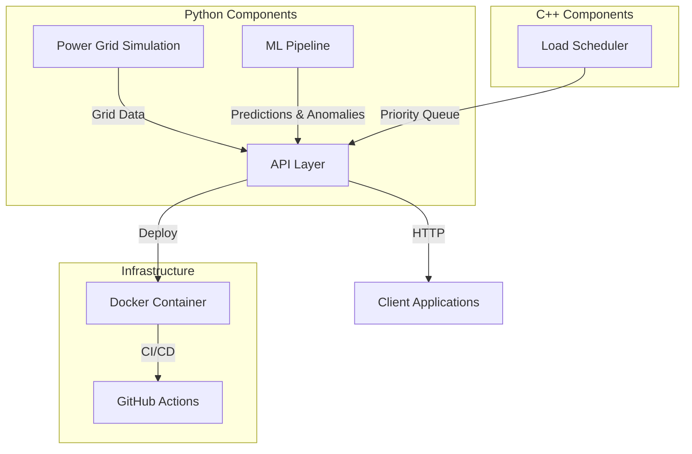
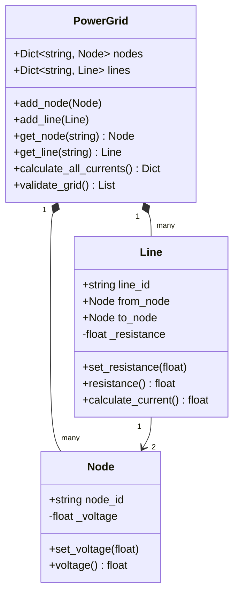
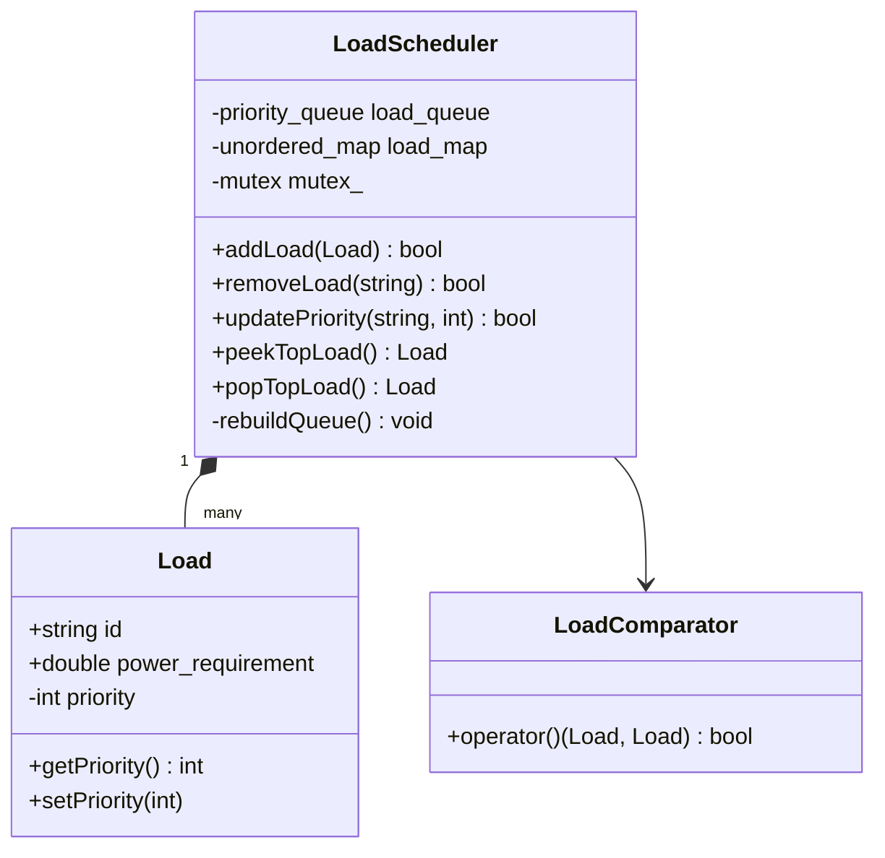
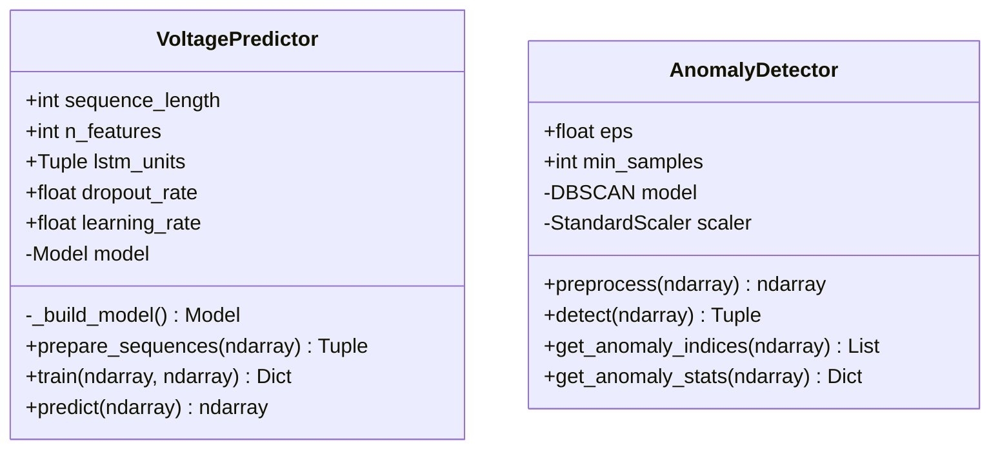
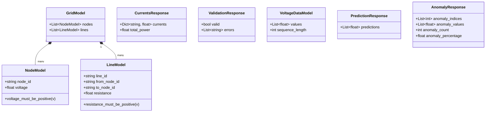
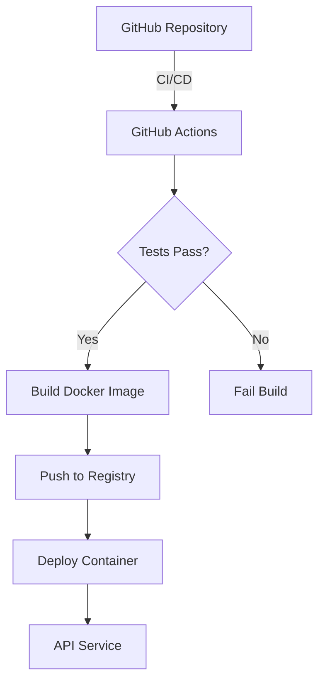
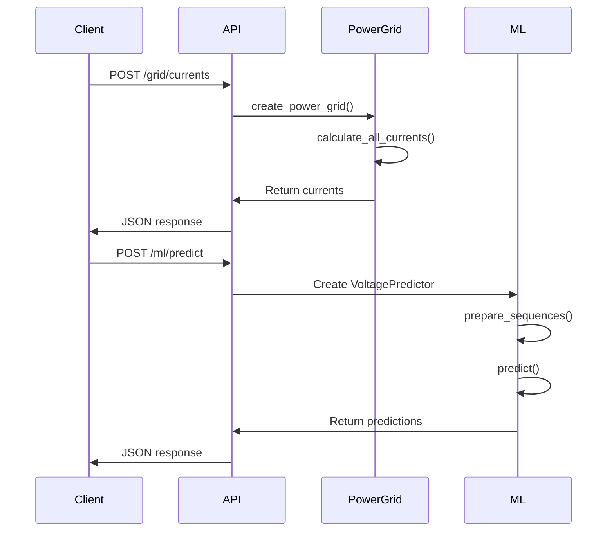

# Smart Grid System Architecture

This document describes the architecture of the Smart Grid Optimization System.

## System Overview

The Smart Grid Optimization System is built using a modular architecture with the following components:

1. **Power Grid Simulation (Python)** - Simulates electrical grid behavior
2. **Load Scheduler (C++)** - Manages load priorities
3. **ML Pipeline (Python)** - Predicts voltages and detects anomalies
4. **API Layer (FastAPI)** - Provides RESTful endpoints

## Architecture Diagram

## Component Details

### Power Grid Simulation

### Load Scheduler

### ML Pipeline

### API Layer

## Deployment Architecture

## Data Flow

